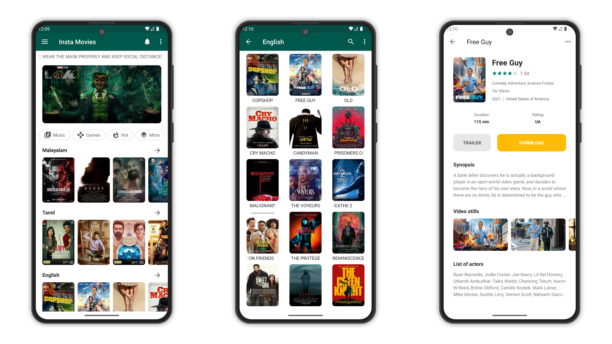

# Insta Movies (Deprecated)

Insta Movies is an Android app which allows you to watch, stream and download FREE and 1080p HD TV
shows and movies on your Android devices. It provides almost latest TV shows and movies. Absolutely
free. You can download them on your Android device or watch online. Watching movies and TV shows are
the best entertainment!

## Screenshots

<picture>
  <source media="(prefers-color-scheme: dark)" srcset="screenshots/screenshot-dark.png">
  <source media="(prefers-color-scheme: light)" srcset="screenshots/screenshot.png">
  
</picture>

## License

```
Copyright 2021 The Android Open Source Project

Licensed under the Apache License, Version 2.0 (the "License");
you may not use this file except in compliance with the License.
You may obtain a copy of the License at

    https://www.apache.org/licenses/LICENSE-2.0

Unless required by applicable law or agreed to in writing, software
distributed under the License is distributed on an "AS IS" BASIS,
WITHOUT WARRANTIES OR CONDITIONS OF ANY KIND, either express or implied.
See the License for the specific language governing permissions and
limitations under the License.
```

Feel free to explore the code and use this project as a reference for your own Android development
endeavors. If you have any questions or need assistance, please don't hesitate to reach out.

Happy learning!
